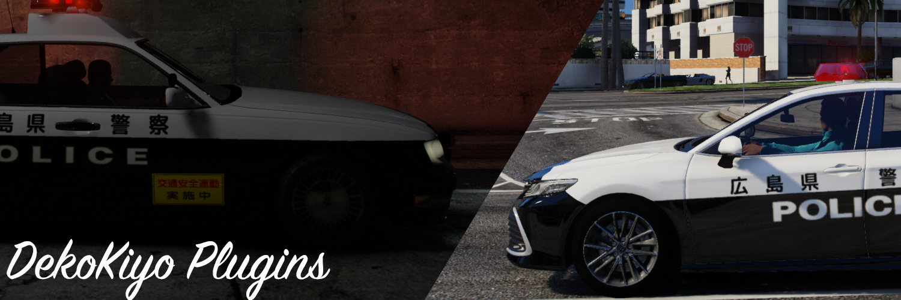

<p align="center">

[](https://www.lcpdfr.com/downloads/gta5mods/scripts/43022-dynamic-lspdfr-add-callouts-and-more/)<br>
[](https://discord.gg/ZxJbeR9Agg)<br>

> **Note**<br>
> DekoKiyoPlugins公式鯖は基本的に会話言語が英語なので、<br>
> 日本人の方はDekoKiyoの個人鯖があるのでそちらでもサポートさせていただきます。<br>
[](https://discord.gg/umjR5nbkh3)<br>

[](https://twitter.com/DekoKiyomori)
[](https://github.com/Dekokiyo/DekoKiyoPlugins)<br>
[](https://www.lcpdfr.com/downloads/gta5mods/scripts/43022-dynamic-lspdfr-add-callouts-and-more/)

</p>

---
```
Copyright 2023 DekoKiyo
```
---

# DekoKiyo Callouts
<p align="center">
DekoKiyo Calloutsは多数のコールアウトをLSPDFRに追加します。<br>
まだ開発が始まったばかりなのでこれからどんどん増えていきます。<br>

[](https://github.com/Dekokiyo/DekoKiyoPlugins/wiki#plugin-supported-languages)<br>
DekoKiyo Calloutsは多言語対応しています。<br>
※DekoKiyo Calloutsの翻訳を使用するにはDekoKiyo Toolsが必要です。<br>
翻訳したい言語がある場合はDiscordサーバーで気軽にお声がけください。<br>

[](https://github.com/Dekokiyo/DekoKiyoPlugins/wiki/CustomTranslationEN)<br>
DekoKiyo Calloutsはカスタム翻訳が作成可能です。<br>
plugin/LSPDFR/DekoKiyoPlugins内のDekoKiyoCalloutsCustomTranslation.iniにあなたの翻訳を書き込み、<br>
総合メニューで言語を「Custom」にしてください。プラグインの言語にカスタム翻訳が適用されます。<br>
もしその言語がまだこのプラグインに搭載されていないなら、Discordサーバーで声をかけてくださると標準搭載することも可能です。<br>

[](https://github.com/Dekokiyo/DekoKiyoPlugins/wiki/CalloutsEN)<br>
DekoKiyo Calloutsはいくつかのコールアウトを追加します。<br>
1. 盗難車両の追跡
2. ギャングによる銃撃戦
3. 指名手配犯を発見
4. 大追跡
5. コンビニ強盗
6. 回転寿司での迷惑行為
7. 現金輸送車強奪
8. 路上での喧嘩
9. 銀行強盗
10. ひき逃げ
11. 危険人物を発見

将来的にもっと多くのコールアウトが追加されます!<br>

[](https://github.com/Dekokiyo/DekoKiyoPlugins/wiki/RandomNumEN)<br>
DekoKiyo Calloutsで使用する乱数生成アルゴリズムを指定できます。
1. デフォルト (System.Random)
2. メルセンヌ・ツイスタ
3. XorShift
<br>

[](https://github.com/Dekokiyo/DekoKiyoPlugins/wiki/CreditsEN)<br>

</p>

## 使用しているライブラリ

[](https://www.newtonsoft.com/json)<br>
翻訳ファイルのデシリアライズに使用しています。<br>
[](https://github.com/alexguirre/RAGENativeUI)<br>
総合メニューなどのUI表示に使用しています。<br>

## 前提動作条件
[](https://www.lcpdfr.com/downloads/gta5mods/g17media/7792-lspd-first-response/)<br>
<br>
<br>

## 翻訳者
[**翻訳者のクレジット**](https://github.com/Dekokiyo/DekoKiyoPlugins/wiki/CreditsEN#translator)

## サポーター
アイデア: きわたに<br>
プラグインのロゴ: shqrk18